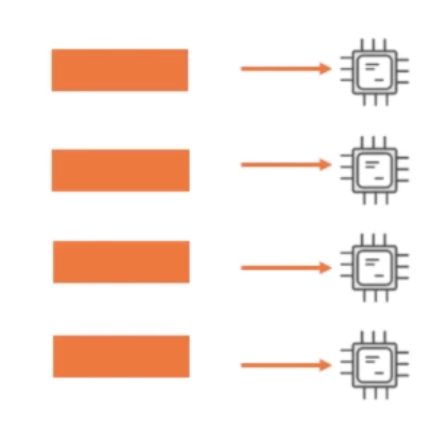

# python-concurrency-learning
Scripts for understanding concurrency in Python

Despite Python's popularity and it's use in multiple areas from desktop and web development to scientific computing, 
many still regard it as single threaded langugage. In this article, we're going to learn how to execute tasks concurrently
using pure Python. Some of the topics we'll cover are:
- Python threading API
- Using multiprocessing
- The new asyncio module

Only prerequiste that is required are the basics of Python.
By the end of this article, we should be able to develop more efficient concurrent apps in Python. 
So Let's dive in

Concurrent.Futures API - which was provided to simplify the execution of parallel tasks and finally we'll examine the
asynchrous programming capabilities.

### Motivation
Inorder to make our applications run faster and to evolve the way hardware is evolving, we must employ concurrency technique
to allow them take full advantage of multi-core hardware by executing instructions on multiple cores simultaneously.

### Concurrency Concepts
Concurrency is execution of multiple instruction sequences at the same time.
However the instruction sequences should be largely independent of each other
in terms of order of exeuction and shared resources.

### Types of Concurrency
The two main forms of concurrency that we'll focus on this article are:
- Parallel Programming
- Asynchronous Programming

#### Parallel Programming
Parallel Programming involves taking a computational task and splitting it into smaller subtasks
that are then assigned to multiple threads or processes to be executed on multiple processor cores
simultaneously. <br />

<p align="center">
	
</p> <br />

Parallel programming is best suited for tasks that are CPU intensive example: graphics processing,
search algorithms, string operations etc.

#### Asynchronous Programming
If you have a task in which most of the time is spent reading from or writing to a device,
more commonly known as performing input or output, then that task is more suited for asynchronous
programming. examples are database read and writes, web service calls, copying or downloading data etc.


### Concurrency in Python
Python supports both parallel and asynchronous programming natively. <br />

<p align="center">
	
</p> <br />

The threading module was introduced way back in Python 1.5, and allows us to create
thread objects that are mapped to native operating system threads, and can be used for 
concurrent execution of code.
NOTE: It should be noted that in CPython, the most common implementation of Python, threads
are limited to executing Python code serially by a mechanism called Global Interpreter Lock (GIL) <br />

The multiprocessing package is an implementation of parallelism that use sub-processes instead of threads.
The technique avoids the GIL and allows Python to take advantage of multiple processor cores. The multiprocessing
module was introduced in Python 2.6 and has some new APIs along with that of the threading module. <br />

The concurrent.futures module was introduced in python 3.2 and provides a common high level interface for using \
threads pools or process pools. <br />

And finally in Python 3.4, the asyncio module was introduced as a provisional package to enable asynchronous programming.

### Demo Application - Thumbnail Maker Library
The function of this library is that it takes image of certain size and produces smaller copies
of the original image, while keeping the dimensions intact.<br />

<p align="center">
	
</p> <br />

Thumbnail Maker Workflow
- Download the image from the source location
- Perform the resize operation
The Download operation is an IO bound task, while the resize is a CPU bound task.<br />

`thumbnail_maker_single_threaded.py` defines `ThumbnailMakerService` Class. In its initializer, we define the 
input directory (where list of input images will be downloaded) and the output directory 
(where resized images will be stored) <br />
It has the following three methods:
- `download_images` takes list of image urls to be downloaded and downloads them sequentially
- `performs_resizing` resizes the image into target sizes one-by-one.
- `make_thubnails` is the public interface for Thumbnail Maker Service. It takes the image url list and calls the 
methods needed to complete the resizing operation.

`test_thumbnail_maker.py` is the utitlity script to test various implementations of our thumbnail maker service
### Running single threaded Thumbnail maker
```
python test_thumbnail_maker.py
```
After running, it will download images into `incoming` directory and resize the images and store them in `outgoing`
directory with various target sizes i.e (32, 64 and 200). It will generate the logfile which will show us the time
taken to process the `download_images` method and the `performs_resizing` method.
```
Log  thumbnail_maker_single_threaded.py

INFO:root:START make_thumbnails
INFO:root:beginning image downloads
INFO:root:downloaded 26 images in 40.599753213999996 seconds
INFO:root:beginning image resizing
INFO:root:created 26 thumbnails in 3.765793731999999 seconds
INFO:root:END make_thumbnails in 44.366740209 seconds
```
### The Future Object
A future object is an object that acts a proxy for the result that is yet to be
computed, typically because a computation of its value is not yet complete. <br/>
In Python, a future object enables asynchronous programming. The executor represents
the actor and immediately returns the future object so that the main thread is not 
blocked and can go on doing other things.
```
future = executor.submit(func, args)
... do other things ...
result = future.result()
```
Various methods of future objects are:
- `cancel()` Attemps to cancel execution. Return True if successful
- `done()` returns True if completed or cancelled
- `exception(timeout=None)` returns the exception raised, if any
- `add_done_callback(fn)` attaches function to be called on completion or cancellation
- The `concurrent.futures.wait(fs, timeout=None, return_when=ALL_COMPLETED)` takes in an iterable
of future objects and blocks until the futures are completed.
- The `concurrent.futures.as_completed(fs, timeout=None)` takes a group of future objects and
returns iterator that yield futures as they complete

