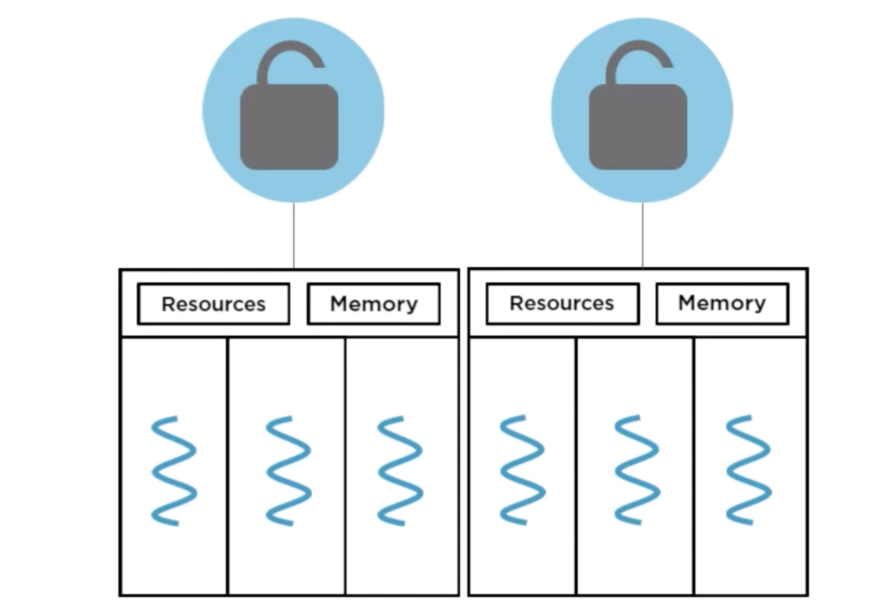
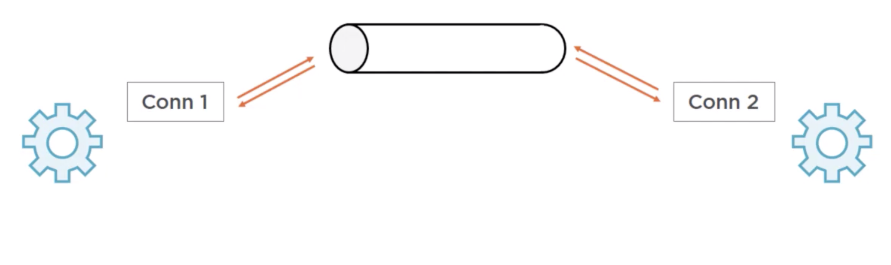
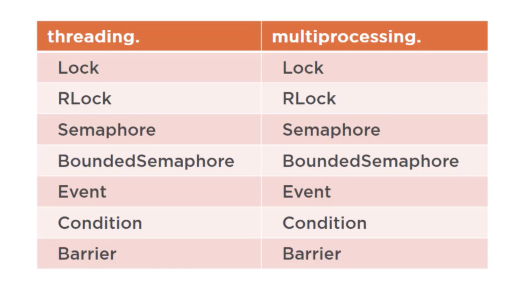

In running Python programs there is one interpreter per process. And since the GIL
is lock on the interpreter, there is one GIL per process. Therefore, if we want to get around 
GIL blocking multiple instructions from running simultaneously on different cores, we can create 
copies of process.

<p align="center">
	
</p> <br />

### Multiprocessing API
It is designed to be similar to threading API so that switching b/w the two is as simple as changing
few lines of code. Here's the example
```
import multiprocessing

def do_some_work(val):
    print('doing some work in process')
    print('echo: {}'.format(val))
    return
    
if __name__ == "__main__":
    val = "text"
    p = multiprocessing.Process(target=do_some_work, args=(val,))
    p.start()
    p.join()
```
Note that arguments passed to the target function above must be picklable. <br />
Pickling is the process whereby a Python object hierarchy is conveted into a byte stream.
Terminology is similar to serializing and deserializing or marshaling or unmarshaling.

Here's the full signature of the multiprocessing.Process constructor
(fully compatible to the threading.Thread constructor)
```
class multiprocessing.Process(group=None,
                              target=None,
			      name=None,
			      args=(),
			      kwargs={},
			      daemon=None)
```
Daemon process is a child process that does not prevent its parent process from exiting. <br />
Unlike threads, processes are killable via an OS provided API. In Python, we can use the
`is_alive()` method and the `terminate()` method for same.

### Process Pools
An easy way to setup a pool of worker processes that can accept and execute tasks
in parallel is to use a process pool. <br />
Constructor for multiprocessing.Pool class looks like:
```
class multiprocessing.Pool([num_processes
                              [, initializer
			      [, initargs  # picklable not required
			      [, maxtasksperchild ]]]] ))
```
- We can specify the number of working processes, if set to None, 
then by default it will be set to no. of CPU cores available on machine.<br />
- We can also set the optional `initializer` function or `initargs`. If set,
each worker process executes the initializer function once at startup. Also, 
`initargs` function may need not be picklable.
- `maxtasksperchild`, by default is set to `None`, meaning worker processes live as 
long as the pool is alive. If set, then after executing specified no. of tasks, a worker 
process is killed and replaced with new worker process. This ensures that long running 
worker process periodically release any system resources it holds. <br />
The most common usage pattern for using process pool is to define a function to be 
executed and an iterable of items that serve as the function argument and then using the
`pool.map(func, iterable[, chunksize])` method to apply the function to each value in parallel. <br />
Example for using the pool of worker process:
```
import multiprocessing

def do_work(data):
    return data**2
    
def start_process():
    print('Starting', multiprocessing.current_process().name)

if __name__ == "__main__":
    pool_size = multiprocessing.cpu_count() * 2
    pool = multiprocessing.Pool(processes=pool_size, initializer=start_process)
    inputs = list(range(10))
    outputs = pool.map(do_work, inputs)
    print('Outputs', outputs)
    
    pool.close()  # no more tasks
    pool.join() # wait for worker processes to exit
```
The `pool.map` method above, applies a target function to every item in the iterable
in parallel by chopping up the iterable into chunks and submitting the chunks, as well
as the target function to the process pool. Therefore both the target function and iterable
must be picklable. `map()` method is a blocking call. `map_async()` is the non-blocking version
for the same.

The pool class also has a `apply` and `apply_async` methods, which allows
us to pass a function and its args to be executed in one of the workers in 
the process pool.
`apply(func[, args[, kwargs]])`

### Inter process Communication
processes must use OS supported data channels if they want to exchange data
with each other. The two communication channels implemented in Python are
- Pipes
- Queue

The multiprocessing pipe involves two connection objects, which represents
two ends of a pipe. A process can write to one of the pipe, while another 
process reads from the other end and vice versa. By default, pipe is duplex, which
means pipe is bidirectional. Here's the example:
```
def make_tuple(conn):
    num = random.randint(1, 9)
    conn.send(('Hi', num))
    print(conn.recv())
    
def make_string(conn):
    tup = conn.recv()
    result = "
    substr, num = tup
    for _ in range(num):
        result += substr
    conn.send(result)
    
if __name__ == "__main__":
    conn1, conn2 = Pipe(True)
    p1 = Process(target=make_tuple, args=(conn1,))
    p2 = Process(target=make_string, args=(conn2,))
    p1.start()
    p2.start()
```
<p align="center">
	
</p> <br />
The Pipe is a fairly simple construct with no built-in locking or 
consistency guarantees. Two processes trying to write to the same end
of the pipe can cause data in the pipe to become corrupted. For this, 
the multiprocessing queue is the more common method of interprocess 
communication.<br />
<p align="center">
	
</p> <br />
The multiprocessing queue uses a pipe, as well as few locks
and semaphores behind the scenes for process safety. <br />
multiprocessing.queue implements all methods of threading.queue like
`qsize(), put(), get(), empty() full()` with the exception of `join() and task_done()` <br />
To illustrate working of queue, let's rewrite above example:

```
def make_tuple(queue):
    num = random.randint(1,9)
    queue.put(('Hi', num))
    print(queue.get())
    
def make_string(queue):
    tup = queue.get()
    result = "
    substr, num = tup
    for _ in range(num):
        result += substr
    queue.put(result)
    
if __name__ == "__main__":
    queue = Queue()
    p1 = Process(target=make_tuple, args=(queue,))
    p2 = Process(target=make_string, args=(queue,))
    p1.start()
    p2.start()
```

### Sharing State between Processes
Although it is best to keep shared state to minimum, because manipulating
shared state can be error prone & require a lot of synchronization steps.
The two options for sharing state b/w processes in Python are: 
- Shared Memory
- Manager Process

### Process Synchronization
The multiprocessing module contains process-enabled equivalents of all of the 
synchronization primitives in the threading module. Therefore when synchornizing
between processes we should use the primitives for the multiprocessing module in
place of the threading version. 
<p align="center">
	
</p> <br />

