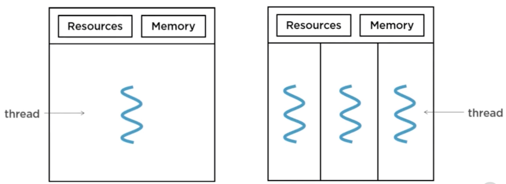
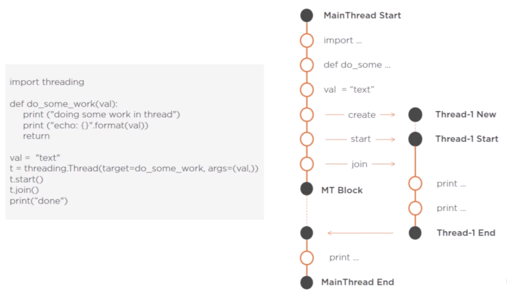
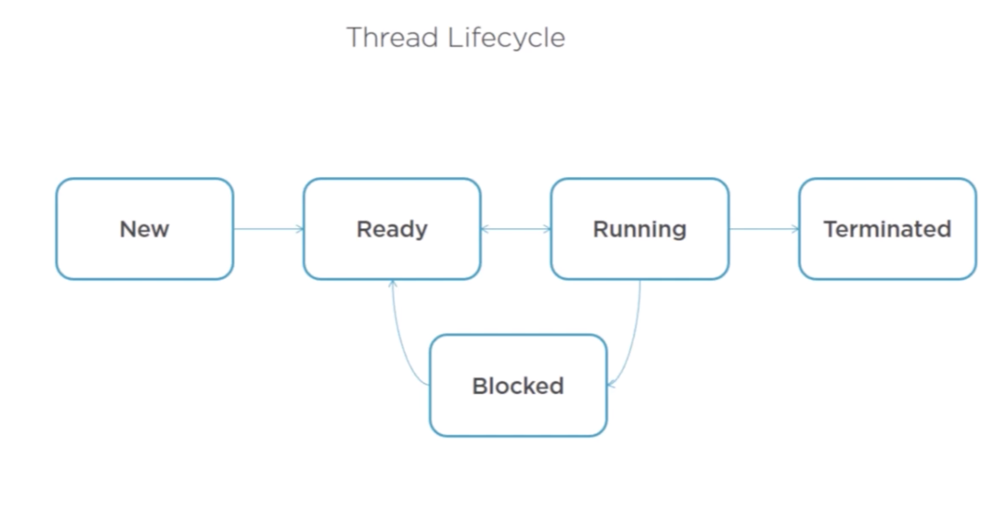
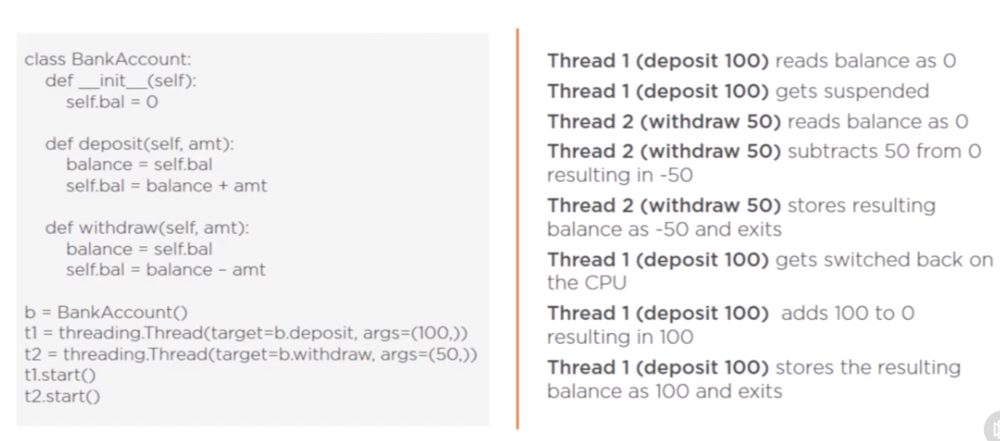

A process can be defined as execution context of a running program. Or simply defined as running instance of a computer program.
Every execution process has system resources and a section of memory that is assigned to it. A process is composed of 
one or more threads of execution.<br />

<p align="center">
        
</p> <br />

A thread is the smallest sequence of instructions that can be managed, that is scheduled 
and executed by the operating system.<br />
The use of multiple threads allows the process to perform multiple tasks at once.<br />
```
For example in a media player, one thread can be running the current song, 
while the other thread is figuring out the next song to play while the other
thread is responding to user clicks and navigation. 
```

### Creating threads in Python
Simplest way to create a thread is to instantiate the object of the thread class, passing in
the thread function and any function arguments.
```
import threading

def do_some_work(val):
    print('doing some work in thread')
    print('echo: {}'.format(val))
    return

val = "text"
t = threading.Thread(target=do_some_work, args=(val,))
t.start()
t.join()
```

The full thread constructor is:
```
threading.Thread(group=None,
                 target=None,
                 name=None,
                 args=(),
                 kwargs={},
                 daemon=None)
```

### Working of Threads
Image below shows the execution flow of multi-threaded program
<p align="center">
        
</p> <br />

A Thread can be in one of the following states:
<p align="center">
        
</p> <br />

Threads within a process share code, common memory space and other OS resources such as open files
or network sockets. Therefore any memory owned by process can be modified by any of the thread.
Memory sharing combined with indeterminate scheduling can lead to suitation known as thread interference.
Below is an example for thread interference.
<p align="center">
        
</p> <br />
